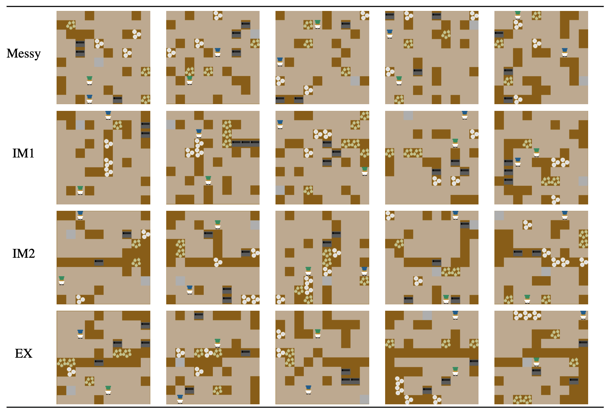

# Cooperative Overcooked PCG
Implementation of the paper, 'Toward Cooperative Level Generation in Multiplayer Game'



## Level Generation Experiment
### Requirement
- [Download Anaconda](https://www.anaconda.com/)
```bash
conda create -n overcookedpcg python=3.8
conda activate overcookedpcg
pip3 install -r requirements.txt
```
  

### Commands
**Messy** (Every task is spread near-randomly in a shared
kitchen. Players have to decide their strategy fully.)
```bash
python3 experiment.py --room_count 1 --pot_count 3 --onion_count 3 --dish_count 3 --outlet_count 1 --factor_distance 0 --factor_between_distance 0 --seed 0
```
**IM1** (Same tasks are grouped and spread in a shared kitchen. Easier to collide between players than Messy.)
```bash
python3 experiment.py --room_count 1 --pot_count 3 --onion_count 3 --dish_count 3 --outlet_count 1 --factor_distance 0.3 --factor_between_distance 0 --seed 0
```
**IM2** (A wall separates the players’ traffic. However, the cooperation is non-mandatory for serving a dish.)
```bash
python3 experiment.py --room_count 2 --pot_count 3 --onion_count 3 --dish_count 3 --outlet_count 2 --factor_distance 0 --factor_between_distance 0 --seed 0
```
**EX**  (A wall separates the players’ traffic, dividing tasks by the wall. Cooperation is mandatory.)
```bash
python3 experiment.py --room_count 2 --pot_count 3 --onion_count 3 --dish_count 3 --outlet_count 1 --factor_distance 0.3 --factor_between_distance 0.9 --seed 0
```

### Results
After the level generating experiment, the outputs (level file, images) are saved in the `results` directory.
```
room2_pot3_onion3_dish3_outlet1_fd0.2_seed0 (Directory name is determined with our experiment parameters.)
├── best_chromosome.json (The statistical result of the best level.)
├── best_level.layout (The file can be loaded on the game environment.)
├── best_original.jpg (The level image before the 'post-processing'.)
├── best_processed.jpg (The level image after the 'post-processing'.)
├── images (The images from the generating process.)
└── parameters.json (The parameters that used in the experiment.)
```

## Code Structure Overview
```text
.
├── GA.py (The genetic algorithm process for Section III.A)
├── LICENSE
├── README.md
├── experiment.py (The entrypoint for running a leven generation experiment)
├── fitness_function.py (The function code for Section III.A)
├── initializer.py (The population initializer in Section III.A)
├── overcooked_ai_py (Overcooked! game environment)
├── utils
└──variables
```

### Disclaimer
All the contents in the `overcooked_ai_py` directory are from the original repository of [HumanCompatibleAI/overcooked_ai](https://github.com/HumanCompatibleAI/overcooked_ai)


